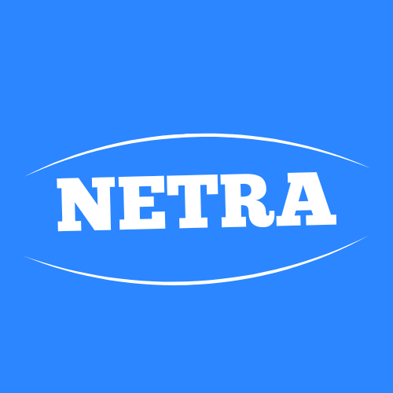

# Netra - Your Gamified Guide to Digital Literacy

<p align="center">
  
</p>

<h3 align="center">See Clearly. Act Wisely.</h3>

<p align="center">
  <strong>A submission for the UNESCO Youth Hackathon 2025.</strong>
</p>

<p align="center">
  
  
  
  
</p>

---

## The Problem

In today's hyper-connected world, youth are on the front lines of a global infodemic. They navigate a digital landscape saturated with sophisticated misinformation, online hate speech, and deceptive AI-generated content. Netra is a comprehensive mobile platform designed to transform this challenge into an opportunity for growth, empowering young people with the critical Media and Information Literacy (MIL) skills needed to thrive online.

## The Solution: A Personal Training Ground

Netra is more than an app; it's an engaging, gamified ecosystem that makes learning digital literacy fun and effective. By leveraging cutting-edge AI as a personal coach, we provide a safe and interactive space for users to learn, practice, and apply their skills.

## Core Features

Our high-fidelity prototype is a fully functional application with four interconnected pillars:

| Feature                | Description                                                                                                                                                                               |
| :--------------------- | :---------------------------------------------------------------------------------------------------------------------------------------------------------------------------------------- |
| 🎓 **The Learn Hub**   | Explore a library of AI-generated, bite-sized lessons on key MIL topics. Solidify your knowledge with interactive quizzes that award XP and track your progress.                          |
| ⚔️ **The Dojo**        | Step into our AI-powered simulator to practice de-escalating realistic online hate and conflict scenarios. Receive instant, detailed coaching on your responses.                          |
| 🖼️ **The Analyzer**    | Suspect an image is a deepfake? Upload it to our AI Analyzer. Get a real-time analysis for common signs of manipulation, turning suspicion into a teachable moment.                       |
| 🏆 **Ranks & Profile** | Stay motivated by tracking your growth. Earn XP, maintain daily streaks, and compete on the global anonymous leaderboard. Level up your personal dashboard and own your learning journey. |

## Tech Stack

Netra is built on a modern, robust, and highly scalable technology stack:

- **Frontend:** **Flutter** - For a beautiful, fast, and cross-platform native mobile experience.
- **Backend:** **FastAPI (Python)** - For a high-performance, asynchronous, and scalable API.
- **AI Model:** **Google Gemini Flash** - The core intelligence for generating lessons, quizzes, scenarios, and performing multimodal image analysis.
- **Database:** **PostgreSQL (Neon)** - For persistent, serverless storage of leaderboard data.
- **Deployment:** **Render** - For continuous, hassle-free deployment of the backend service.

## Getting Started

### Prerequisites

- [Flutter SDK](https://flutter.dev/docs/get-started/install) (3.x or later)
- [Python](https://www.python.org/downloads/) (3.9 or later)
- An IDE like [VS Code](https://code.visualstudio.com/) or [Android Studio](https://developer.android.com/studio)

### Setup Instructions

1.  **Clone the Repository**

    ```bash
    git clone https://github.com/ShresthaSwapnil/SathiAlly
    cd SathiAlly
    ```

2.  **Configure the Backend**

    - Navigate to the backend directory:
      ```bash
      cd backend
      ```
    - Create and activate a virtual environment:
      ```bash
      python -m venv venv
      source venv/bin/activate  # On Windows, use `venv\Scripts\activate`
      ```
    - Install the required packages:
      ```bash
      pip install -r requirements.txt
      ```
    - Create a `.env` file in the `backend` directory and add your secret keys:
      ```
      GOOGLE_API_KEY="your_google_gemini_api_key"
      DATABASE_URL="your_neon_postgresql_connection_string"
      ```

3.  **Configure the Frontend**

    - Navigate to the frontend directory:
      ```bash
      cd ../frontend
      ```
    - Get Flutter packages:
      ```bash
      flutter pub get
      ```
    - Create a `.env` file in the `frontend` directory and add your backend URL.
      - _For local development:_
        ```
        API_BASE_URL="http://<YOUR_COMPUTER'S_LOCAL_IP>:8000/api/v1"
        ```
      - _For a deployed backend:_
        ```
        API_BASE_URL="https://your-render-app-name.onrender.com/api/v1"
        ```

4.  **Run the Application**
    - **Start the backend server** (from the `backend` directory):
      ```bash
      uvicorn app.main:app --host 0.0.0.0 --port 8000 --reload
      ```
    - **Run the Flutter app** (from the `frontend` directory):
      ```bash
      flutter run
      ```

## Our Team

- Aryaman Bista
- Aayush Bhattarai
- Aditya Malla Thakuri
- Diya Shakya
- Swapnil Shrestha

## Acknowledgments & Gratitude

This project was made possible by the incredible tools and platforms provided by the tech community. We extend our sincere thanks to:

- The organizers of the **UNESCO Youth Hackathon 2025** for this inspiring opportunity.
- **Google** for the powerful and accessible Gemini AI.
- The **Flutter & Dart** teams for creating an amazing development experience.
- The creators of **FastAPI** for their exceptional Python framework.
